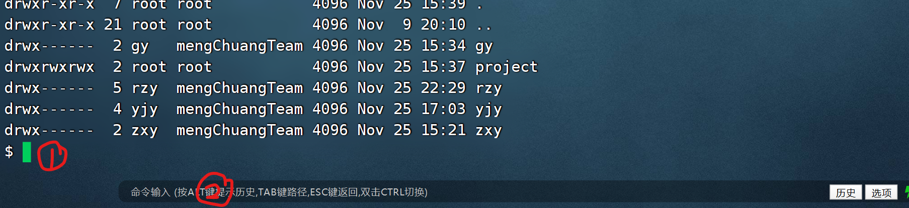

# SSH 服务操作手册

## Step 1 : 获取 SSH 客户端

由于 XShell 是一款付费软件，破解的话~~太麻烦~~太不人道，所以我们使用一款国内大佬开发的 SSH 软件 `FinalShell` ，[点击下载](http://www.hostbuf.com/downloads/finalshell_install.exe)

自行安装，此处不展开聊

## Step 2 : 使用 SSH 客户端访问服务器

打开 FinalShell ，点击左上角的文件夹图标，继续点击弹出的窗口的左上角的文件图标，选择选项 `SSH连接` 

之后，在名称栏给他起个名字，主机栏填写服务器 IP `47.xxx.xxx.225` （为避免恶意攻击，具体 IP 请在群中查看），端口不要修改

认证方法选择密码，用户名和密码可以保存也可以不保存，初次登录建议不保存，因为你也得修改呀（笑）

点击确定，即可访问服务器

## Step 3 : 使用客户端自带的 FTP 功能上传文件

傻瓜式操作，找到你要上传到的文件夹，从桌面拖进去即可，但不要忘了修改访问权限

修改方式如下：鼠标右键文件或文件夹，选择 `文件权限…` 选项，之后为你的文件或文件夹修改访问权限（文件夹记得选择 `递归设置到子目录和文件` ）

注：不要尝试去修改别人的文件的权限，因为你没有权限（这句话真搞笑哈哈哈）

## 关于命令行的提示

如图

1 处命令行输入和本地运行的 Ubuntu Terminal 一致，支持 Tab 补全

2 处命令行一般不用，除非你希望从某处粘贴命令行过来，并将其快速修改